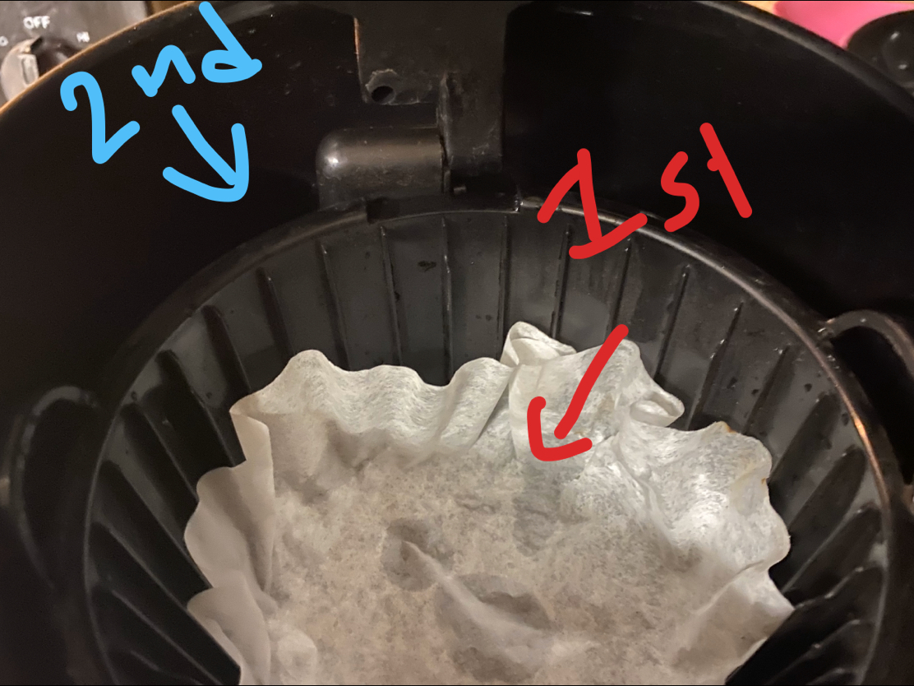
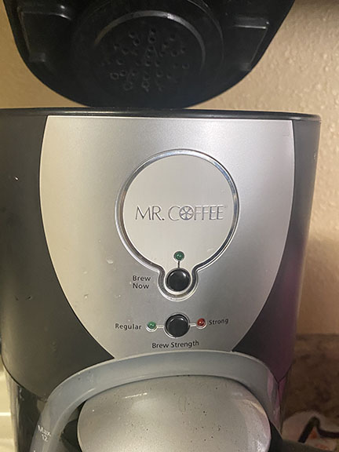

# Mr. Coffee's coffee maker
Israel Ramos

2/22/20

Here is what I noticed when interacting with my coffee maker. Waking up early in the morning to get my regular cup of coffee. My goal when heading towards said coffee maker was to brew the cup of coffee so that when I am done getting ready for the day the coffee would be ready for me to consume. I started by first opening the the main latch. I began to fill up the back compartment in the main latch with water into the to the appropriate number of cups I wanted to brew[1]. Secondly. I laid a coffee filter into the front compartment, I then poured grounded coffee beans onto the filter[2]. I close the compartments then look at the simple button layout[3]. I set brew strength to regular which lit up green then push the button that said "brew now". The light turns green as a **feedback** to me pushing on it, this indicated to me that the coffee maker is now brewing the coffee. I then wait for the coffee maker to fill up which allowed me to to step away and just wait for the coffee to be done. 

[1] Indicators that tell you how many cups of coffee you want to brew

[2] Compartments are addressed by colored arrows. (2nd arrow is pointing behind 1st)

[3] Layout of buttons on coffee maker

This coffee maker is a simple tool that lives in many houses in particular due to its ease of use. One of its main strengths it's
**efficiency**, with a little prep of the machine you can turn it on then tend to your other needs while it does the rest. It finishes it a relatively quick amount of time without hassle. It can also be set to accommodate for whoever wants coffee, you can pour enough water for just yourself or enough for as many of 12 people. Just fill it up to the line and that's it you are done. Another high priority I found when using it was just how **learnable** it is. Having only three buttons it is straight forward what each button does and two of them correlate with each other under "brew strength". Its pretty safe to assume that kids to older adults only need to be taught once to operate this machine.

This transitions directly into the main weakness, it's lack of instructions on two important steps. Nowhere on the coffee maker does it indicate where to insert water and how to prep a coffee filter and ground coffee beans. There are two compartments at the top, but it does not say what they do leaving it to the user to figure out what they do and if they are doing things correctly. This can lead to many first-time mistakes unless they pull out the manual which affects its strength of **efficiency**. 

The Mr. Coffee's coffee maker is an excellent product that comes with very minor confusion for first time users. If there was some symbols and steps printed on the product that indicated what to do with the compartments located at the top it would diminish it's major weakness and would improve the product from the user perspective.

**Feedback**-Sending back to the user info about what action has been done.
**Efficiency**-Measured in terms of task time. that is, the time (in seconds and/or minutes) the participant takes to successfully complete a task.
**Learnable**-How easy it is to complete a task as intended the first time.
