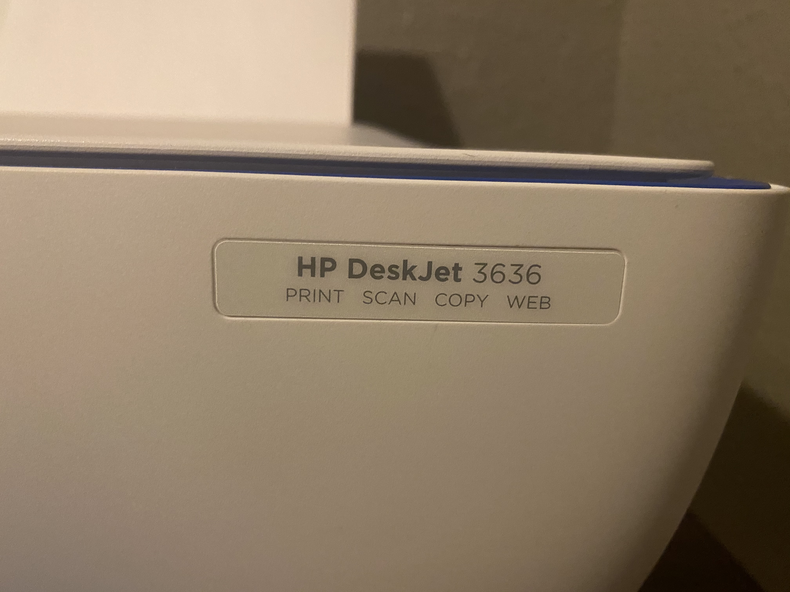
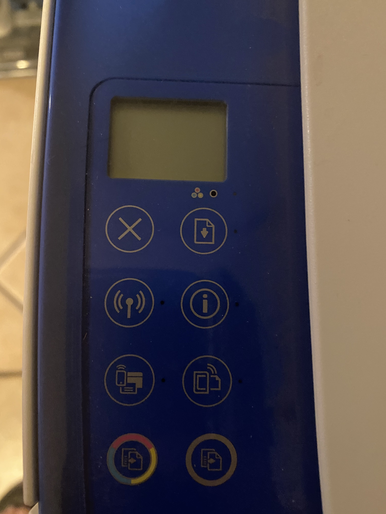
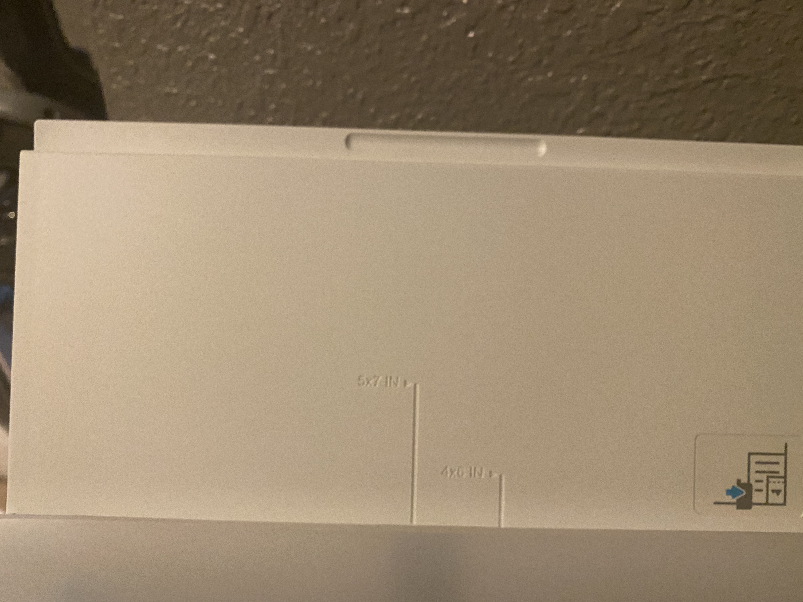
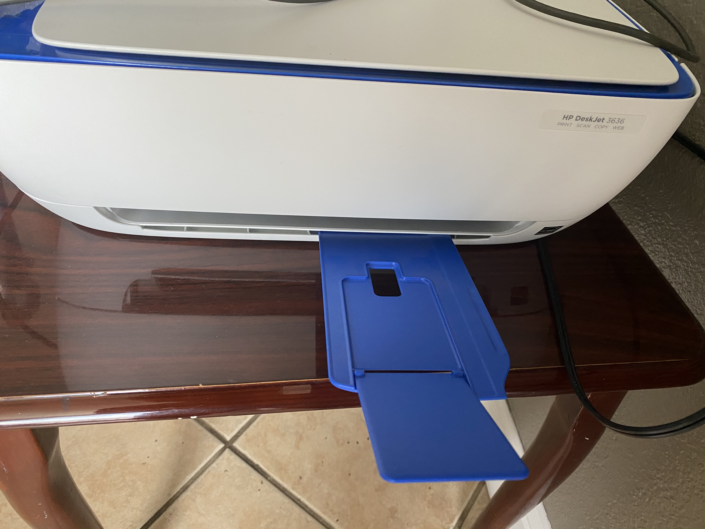
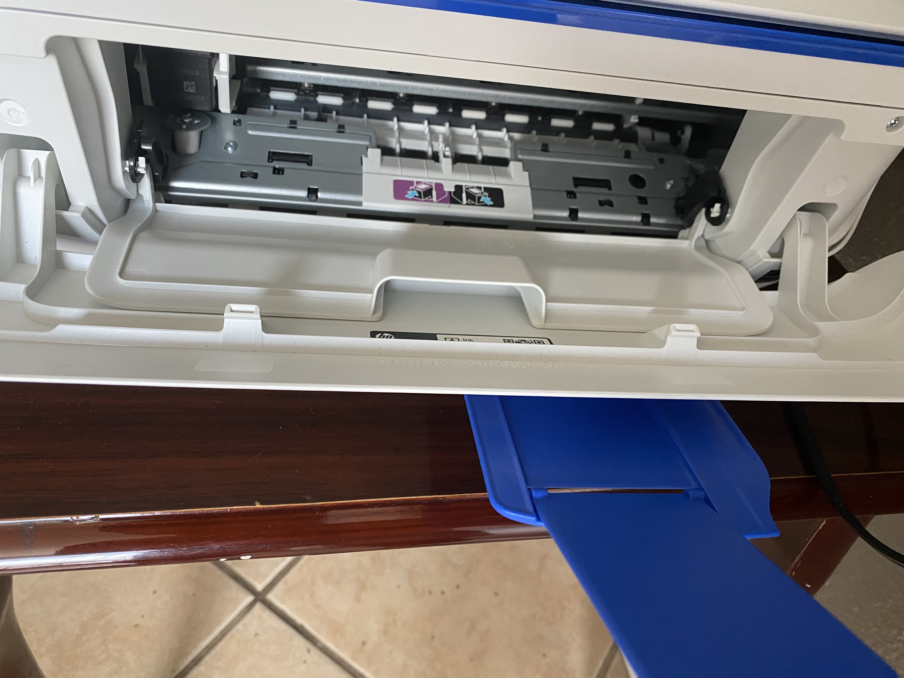
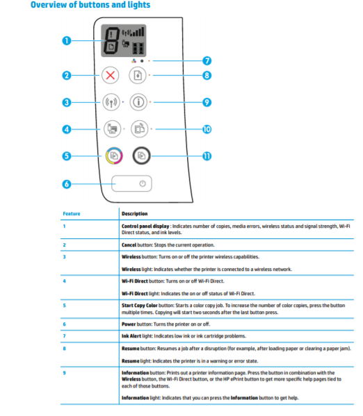
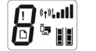

# Canon Deskjet 3636

Israel Ramos
4/12/20

Here is what I noticed when oberserving and using the printer I have at home, the Canon Deskjet 3636. Having miltiple printers at home this was actually the first time I had used this particular printer so I was able to experience it for the first time. I had to print out some pages for an upcoming zoom class. My process for printing the papers I needed was this. I would load up the paper at the back end of the printer in a tray that is sticking up and out. I like that there were indicators for different paper sizes etched into the tray so that you couldn't misplace the paper if it was a different size[3]. I the turned it on by pressing the biggest button on the layout with the power button symbol. I plugged in the USB into my laptop to allow the printer to be recognized. Then from there I used the word document software to print and designated it to the printer I was using. However there was low ink, so I got a replacement ink cartrage. There is a latch in the front though you honestly couldn't tell it was even there which led to revealing the latch that you need to open to reveal where the ink cartridges need to be[4]. Once the cartridge was replaced and  latches closed I pushed the resume button which was the top right one which I learned through you hear the printer come to life and start eating the paper page by page and printing the text onto them and spitting them out[5]. To my content I had all the pages printed correctly and all finished with about eight minutes of effort.

[1] Front label of printer

[2] Printer Button

[3] Paper tray of printer

[4] front of printer

[5] Cartridge compartment

[6] button details

[7] Display

Though I deemed it successful in getting my goal accomplished, that was no thanks to the display or additional buttons on the printer. I just plugged and prayed through the software that it'll work the first time. The symbols on the buttons never give a clear indication of what they do. I had to look at the start guide to see what the icons even did and when to push them if need be. This takes a toll on ***efficiency*** since you would have to take the time to keep looking at the guide[6]. It's also hard for the product to be ***memorable*** since most of the buttons look similar they all include rectangular shapes in the icons with no clear distinction[2]. I would say that. The display is all a mess with icons everywhere filling up the screen[7]. I was honestly shocked at how bad and lost I was with it's display. Again needing a manual to interpret everything I found that apparently errors are suppose to show on the display making it a horror show to solve if one was to occur. 

This printer of course gets the job done. It is simple enough to get your printing, scanning, and copying needs.You will need to use the manual alot with this printer but it isn't that convoluted to follow. I just wish they had kept the user in mind when designing the layout becuase somebody with zero experience using printers would surely be lost. 

**Efficiency**-Measured in terms of task time. that is, the time (in seconds and/or minutes) the participant takes to successfully complete a task.

**Memorable**-Memorability is a measure of how easy a product is to remember after a substantial time-lapse between visits.

