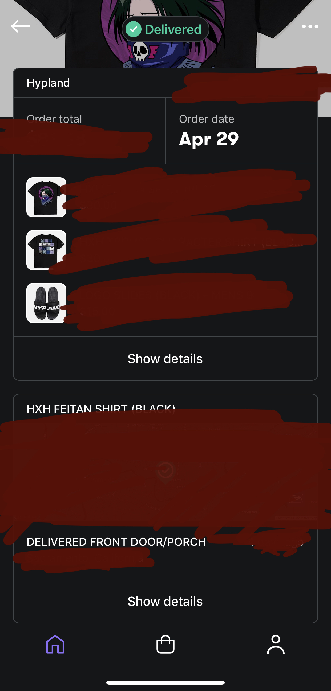

# Shop ex Arrive

Israel Ramos
5/10/20

During quarantine it is only natural that online shopping will spike since most stores are closed during these trying times. I for one have been guilty of online shopping to pass the time. I found that it was really tedious to keep track of online orders since they were from either different retailers shipping companies or the codes just wouldn't even work some of the time. That is when I came across shop, shop is an app that meets my goal of centralizing  all of the things I buy into one app. All I really need to do on the app to start is to link my email account and the app does the rest. After I link my account the process is as easy as shopping at any retailer I like and purchase something I am interested in. When I have finished purchasing and have received my order confirmation, I check back to see that the app has added it to the list of orders and automatically gets order information from the company for me.[1][5]

It's **satisfying** to see items pop up on your feed[1] and also **effective** since I don't have to do much to keep track of the things I have ordered I don't have to go to individual emails from places I have purchased from, I instead go to the shop app and everything I need is in there from current location of package, where it's shipping from, when I'll get my order and much more.[5][6] Say you have multiple emails you order from; you can add multiple emails to keep track of order across all emails you use. You can also add orders manually in the case that an order doesn't show up for whatever reason, just add your order information and that's it your order can be tracked from the app which helps make the product **error tolerant**.

What makes this app great is not only does it handle order information. It is also a shopping hub for all the retailers you have purchased from or have added in your list of shops you have acquired interest in.[2] It has shop info to retailers you like including price, new arrivals, and quick links to the product shown by just pressing on the image.[3] It keeps you updated on your favorite stores without even going into the website.

Using there app also benefits trees. The are working with another company called Pachama that are working to help protect trees in the rainforest. While you will impulse buy during these times the app help keep the world a better place as you use it.[7]

However, it is not perfect. I did find that I had to enter my order once manually and delivery notification  would be delayed by an hour on some orders. It must take a while to sometimes pull the updated information or it can also be the shipping company also updating late. That could be something they may have to work on in the future, but it does not affect what the app tries to accomplish which is a centralized  location to shop and also receive order information.

[1] Home Page 

[2] Shop page

[3] Shop scroll downed some more

[4] Profile page

[5] Click on order for detail

[6] Order detail page scrolled down

[7] Impact app has done since you shopped at the app

